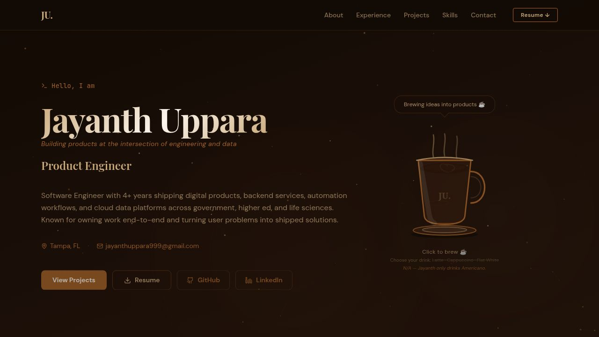

# Jayanth Uppara — Portfolio

  > **Live site:** [jayanthuppara1.replit.app](https://jayanthuppara1.replit.app) *(or your custom domain once deployed)*

  A coffee-themed personal portfolio built to showcase my engineering experience, featured projects, and skills in a way that's a little more interesting than a PDF.

  

  ---

  ## What's inside

  | Section | What you'll find |
  |---|---|
  | **About** | Introduction, taglines, and an interactive coffee mini-game (click the cup ☕) |
  | **Experience** | Timeline of roles and responsibilities |
  | **Projects** | Flip-card showcase: TogetherFlow, Photo Organizer, USF Dining App |
  | **Skills** | Categorized technical skills |
  | **Contact** | Contact form + resume download |

  ---

  ## Tech stack

  | Layer | Technology |
  |---|---|
  | Framework | [React](https://react.dev) + [TypeScript](https://www.typescriptlang.org) |
  | Build tool | [Vite](https://vitejs.dev) |
  | Styling | [Tailwind CSS](https://tailwindcss.com) |
  | Animation | [Framer Motion](https://www.framer.com/motion) |
  | Routing | [Wouter](https://github.com/molefrog/wouter) |
  | Icons | [Lucide React](https://lucide.dev) |
  | UI primitives | [Radix UI](https://www.radix-ui.com) |

  ---

  ## Running locally

  ```bash
  # Install dependencies
  pnpm install

  # Start the dev server
  pnpm --filter portfolio dev
  ```

  The site will be available at `http://localhost:5173`.

  ---

  ## Contact

  **Jayanth Uppara** · jayanthuppara999@gmail.com · Tampa, FL  
  [LinkedIn](https://linkedin.com/in/jayanthuppara) · [GitHub](https://github.com/jayanthuppara1)
  